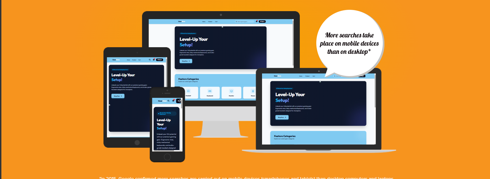
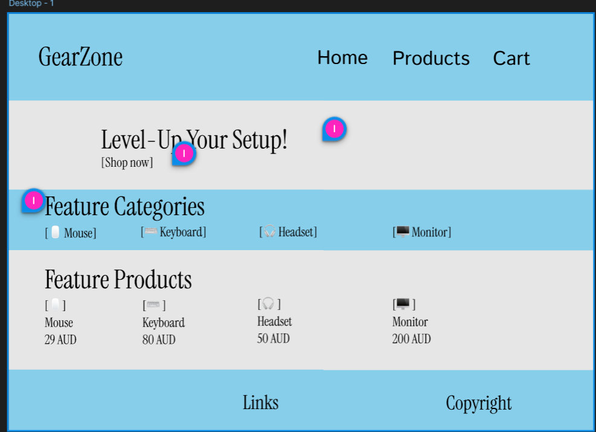
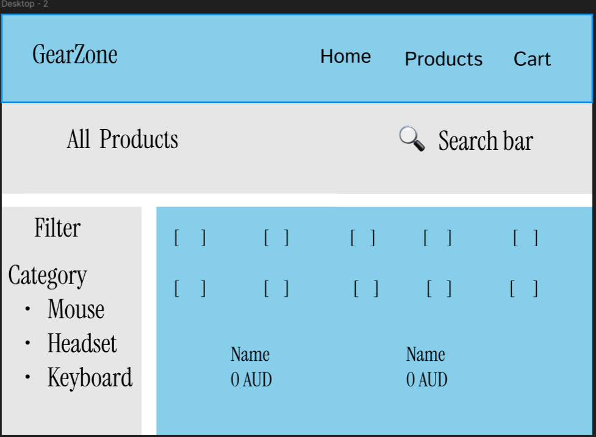
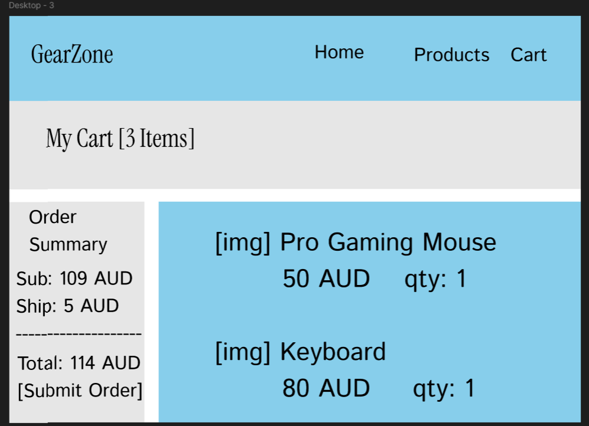
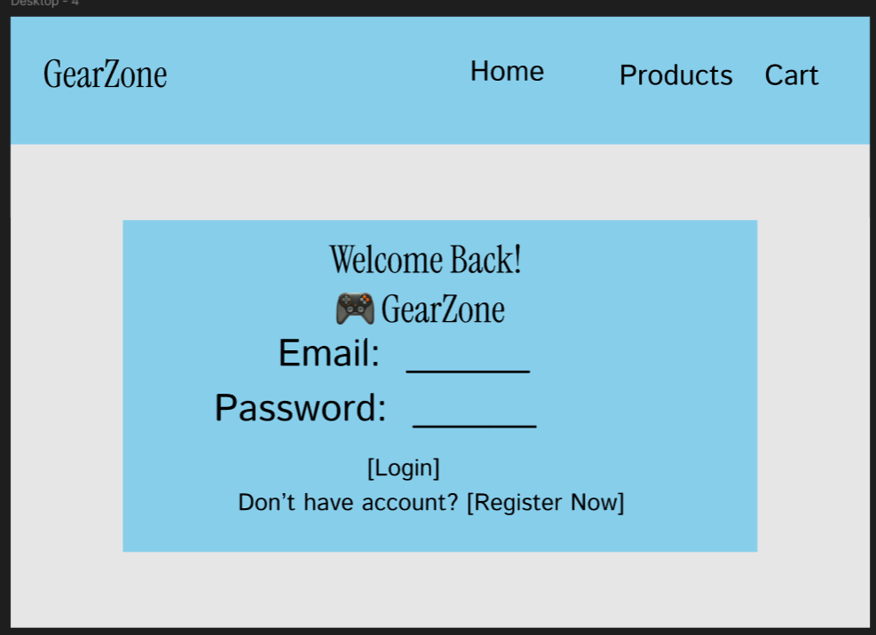

# GearZone E-Commerce Project

A Django-based E-Commerce system with PostgreSQL database integration and Supabase Storage for file storage (transfer proof & product photos).

Here is the result of the mock-up test.



Here is the functional link.

[GearZone](https://gearzone.onrender.com)

# Feature

Using figma to create the wireframe for the formation of the design for the website.









## Existing Features

## 🚀 Guide to Running the Project Locally

Follow these steps to run the project on your local machine:

### 1. Set Up a Virtual Environment
Create and activate a Python virtual environment:
* **Windows (Command Prompt):**
  ```bash
  python -m venv venv
  venv\Scripts\activate
  ```
* **macOS / Linux:**
  ```bash
  python3 -m venv venv
  source venv/bin/activate
  ```

### 2. Install Dependencies
Install the required libraries and modules using the `requirements.txt` file:
```bash
pip install -r requirements.txt
```

### 3. Configure Environment Variables
Copy the example configuration file `.env.example` to `.env`:
```bash
cp .env.example .env
```
Open the new `.env` file and fill in the following variables:
* `SUPABASE_URL` & `SUPABASE_KEY`: Your Supabase account credentials.
* `DATABASE_URL`: Your PostgreSQL database connection string (can be left empty if you want to use the local SQLite `db.sqlite3` for development).
* `SECRET_KEY`: Your Django secret key.

### 4. Run the Initial Database Migration
Apply the database schema for the first time to local SQLite or PostgreSQL:
```bash
python manage.py migrate
```

### 5. Create an Administrator Account (Superuser)
Create an admin account to log in to the Admin Dashboard page:
```bash
python manage.py createsuperuser
```
Follow the prompts in the terminal to fill in the *username*, *email*, and *password*.

### 6. Run the Development Server
Start the local server:
```bash
python manage.py runserver
```
Open your browser and go to `http://127.0.0.1:8000/`.

---

## 🌐 Guide to Deploying on Render.com

To deploy this Django application to Render.com, you can use the **Web Service** type. Here are the configuration steps:

### 1. Add the WSGI Server Dependency
Before deploying, make sure you add a WSGI server such as `gunicorn` to the `requirements.txt` file:
```text
gunicorn
```
*(Or install it locally first: `pip install gunicorn` then run `pip freeze > requirements.txt`)*

### 2. Create a Build Script File (`build.sh`)
Create a file named `build.sh` in the root directory of your project to automate the build process on Render:
```bash
#!/usr/bin/env bash
# exit on error
set -o errexit

pip install -r requirements.txt

python manage.py collectstatic --noinput
python manage.py migrate
```
*Note: Make sure this file is executable by running `chmod +x build.sh` before committing it.*

### 3. Configure the Web Service on Render.com
Create a **New Web Service** on the Render dashboard, connect it to your GitHub repository, and set the following parameters:
* **Runtime**: `Python`
* **Build Command**: `./build.sh` (or without a script: `pip install -r requirements.txt && python manage.py collectstatic --noinput && python manage.py migrate`)
* **Start Command**: `gunicorn core.wsgi:application`

### 4. Configure Environment Variables on Render
In the **Environment** tab of your Render service, add the following variables:
* `SECRET_KEY`: Your production Django secret key.
* `DATABASE_URL`: Your production PostgreSQL database connection link.
* `SUPABASE_URL`: Your Supabase API link.
* `SUPABASE_KEY`: Your Supabase API/anon key.
* `PYTHON_VERSION`: `3.10.x` or the version matching your local environment.

## 🐳 Guide to Deploying with Docker on Render.com

If you prefer to deploy using a Docker container on Render.com, follow the steps below:

### 1. Docker Configuration Files
Make sure your repository already contains the [Dockerfile](Dockerfile) and [.dockerignore](.dockerignore) files in the root directory of the project.

### 2. Create a New Web Service on Render
1. On the Render dashboard, click **New** -> **Web Service**.
2. Connect your GitHub repository.
3. In the **Runtime** option, select **Docker** (Render will automatically detect the `Dockerfile` in your repository).

### 3. Configure Environment Variables on Render
In the **Environment** tab of your Render service, add the following variables (same as before):
* `SECRET_KEY`: Your production Django secret key.
* `DATABASE_URL`: Your production PostgreSQL database connection link.
* `SUPABASE_URL`: Your Supabase API link.
* `SUPABASE_KEY`: Your Supabase API/anon key.

Render will automatically build the Docker image and run the application every time you push to the main branch.
